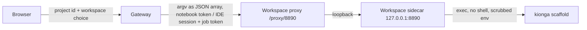

# Scaffolding projects in a workspace

A Kionga project stores a versioned template choice (template, version,
framework, accelerator, resource profile). The scaffold turns that choice into
a production-shaped starter: package, tests, CI, Dockerfile and a platform
manifest. Files are written only when you run it.

## Where the code goes

Every project has one folder, resolved by one function in the gateway
(`resolveProjectPath`, `go/internal/httpapi/workspace_paths.go`):

| Consumer | Path |
| --- | --- |
| Scaffold output | `/workspace/projects/<namespace>` |
| JupyterLab launch | `/workspaces/workbench/lab/tree/projects/<namespace>` (Jupyter's root is `/workspace`) |
| IDE launch | `?folder=/workspace/projects/<namespace>` |

`/workspace` is the shared `jupyter-data` volume in Compose and the workspace
PVC in Kubernetes, so JupyterLab, the IDE and the scaffold always agree.

## Two ways to run it

**Copy the command.** The project page shows the exact command, for example:

```bash
kionga scaffold churn-model --template production-ml --template-version 1.0.0 \
  --framework xgboost --accelerator cpu --profile team
```

Run it from `/workspace/projects` in a workspace terminal.

**Run in workspace.** Choose **Run in workspace…** on the project page. The
confirmation dialog shows the workspace that will run it, the working and
output folders, the exact command and every argument. Nothing runs until you
confirm. Progress updates live; the result lists the produced files, `git
status --porcelain`, the command output (secrets redacted) and any error. A
second run against a folder that already has files fails with
`target already exists and is not empty`; the scaffold never overwrites work.

## API

| Method | Path | Purpose |
| --- | --- | --- |
| `GET` | `/api/v1/projects/{id}/scaffold-plan` | What would run, where, and whether a workspace can run it |
| `POST` | `/api/v1/projects/{id}/scaffold-jobs` | Start a job. Body: `{"options":{"workspace":"workbench"\|"ide"}}` (optional) |
| `GET` | `/api/v1/projects/{id}/scaffold-jobs` | Jobs for the project, newest first |
| `GET` | `/api/v1/projects/{id}/scaffold-jobs/{job}` | One job |

A job is `queued`, `running`, `succeeded` or `failed`, with `started_at`,
`ended_at`, `exit_code`, `output_tail`, `files`, `git_status`, `error` and
`requested_by`. Only one job per project runs at a time (`409` otherwise). A
job that does not report within 5 minutes (gateway restart, workspace gone)
is marked failed as interrupted. Project access is enforced: a project you
are not assigned to returns `404`. API tokens, viewers and service accounts
cannot run jobs, because they cannot drive workspaces.

## Trust boundary



- **The browser sends no command.** The request accepts only `options.workspace`
  and rejects unknown fields.
- **The gateway builds the argv** from the stored project, re-normalized
  against the versioned template catalog. Every value must match
  `^[a-z0-9][a-z0-9.-]{0,62}$`; the namespace must be a DNS label. Shell
  metacharacters, newlines, `../`, and look-alike Unicode are rejected.
- **The gateway never executes anything** and never holds the Docker socket. It
  posts the argv to the workspace through the same authenticated proxy it
  already uses: Jupyter via `jupyter-server-proxy` at
  `/workspaces/workbench/proxy/8890` with the notebook token, code-server via
  `/proxy/8890` with the IDE session.
- **The sidecar re-validates.** `deploy/workspace/directories.py` accepts only
  `kionga scaffold <namespace>` plus the flags `--template`,
  `--template-version`, `--framework`, `--accelerator`, `--profile` (once each).
  `--prompt` and `--agent` are not allowed. It requires
  `X-Kionga-Workspace-Token` (constant-time compare), runs with `shell=False`,
  in `/workspace/projects`, with only `PATH`, `LANG`, `HOME` and
  `KIONGA_WORKSPACE` in the environment, a 60 s timeout, one job at a time,
  and redacts secret-looking values from output.
- **Blast radius** is the user's own workspace, which they can already change
  from a terminal. The sidecar adds no capability they do not have.

### Tokens

| Deployment | Gateway sends | Sidecar expects |
| --- | --- | --- |
| Compose | `KIONGA_WORKSPACE_JOB_TOKEN` | `KIONGA_WORKSPACE_JOB_TOKEN` (set on gateway, jupyter, ide) |
| Kubernetes per-user workspace | the workspace's generated credential | `JUPYTER_TOKEN` / `PASSWORD` from the same secret |

Change `KIONGA_WORKSPACE_JOB_TOKEN` from its local default in any shared
deployment.

## Kubernetes Job execution (planned)

Running scaffolds as Kubernetes Jobs that mount the user's workspace PVC is
planned. Today the per-user workspace pod runs them through its own sidecar,
which already gives per-tenant isolation without a cluster-wide job runner.

## Troubleshooting

| Message | Fix |
| --- | --- |
| `This workspace image has no scaffold runner` | Rebuild the workspace images (`make local-rebuild`) so they include the sidecar and `jupyter-server-proxy` |
| `The workspace rejected the scaffold credential` | Make `KIONGA_WORKSPACE_JOB_TOKEN` identical on gateway and workspace, then restart both |
| `Scaffold jobs need KIONGA_WORKSPACE_JOB_TOKEN` | Set the token (Compose sets a local default) |
| `target already exists and is not empty` | The project already has code; open it in JupyterLab or the IDE |
